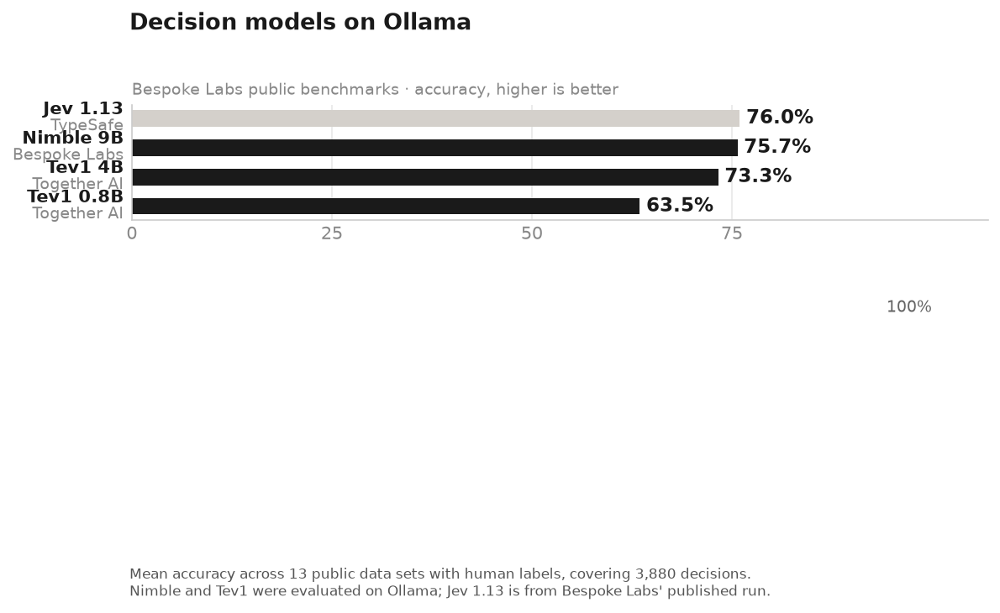

# Jev-Style Decision Model Evaluation

Benchmarks Ollama's new decision models (requires Ollama 0.35+) across 3 real-world industry problems using real HuggingFace datasets.

## Models

| Model | Provider | Backend |
|-------|----------|---------|
| `jev` (1.13) | TypeSafe | Cloud API |
| `nimble` (9B) | Bespoke Labs | Ollama local |
| `tev1` (4B) | Together AI | Ollama local |
| `tev1:0.8b` | Together AI | Ollama local |

## Industry Problems

| Problem | Dataset | Samples |
|---------|---------|---------|
| E-commerce ticket triage | [bitext/Bitext-customer-support-llm-chatbot-training-dataset](https://huggingface.co/datasets/bitext/Bitext-customer-support-llm-chatbot-training-dataset) | 48 |
| Healthcare symptom urgency | [gretelai/symptom_to_diagnosis](https://huggingface.co/datasets/gretelai/symptom_to_diagnosis) | 50 |
| Finance fraud detection | [SetFit/enron_spam](https://huggingface.co/datasets/SetFit/enron_spam) | 50 |

## Benchmark Results



### Detailed Results (148 samples · 592 API calls)

| Model | E-commerce | Healthcare | Finance | Mean Acc | Avg Latency |
|-------|-----------|-----------|---------|----------|-------------|
| jev 1.13 | 68.1% | 47.0% | 84.0% | **66.4%** | 923ms |
| nimble 9B | 70.8% | 38.0% | 80.0% | 62.9% | 2481ms |
| tev1 4B | 71.5% | 37.0% | 83.0% | 63.8% | 1171ms |
| tev1 0.8B | 56.2% | 38.0% | 54.0% | 49.4% | **300ms** |

_148 samples · 592 API calls · evaluated on 2026-10-01_

## Setup

```bash
# Requires Ollama 0.35+
ollama pull nimble
ollama pull tev1
ollama pull tev1:0.8b

# Install dependencies (Python 3.13)
python3.13 -m venv .venv
.venv/bin/pip install -r requirements.txt

# Set your TypeSafe Jev API key
cp .env.example .env
# edit .env and add your JEV_API_KEY
```

## Usage

```bash
# Run with real HuggingFace data
.venv/bin/python3.13 eval.py --hf

# Run specific models only
.venv/bin/python3.13 eval.py --hf --models jev nimble tev1:0.8b

# Run with synthetic data (no downloads)
.venv/bin/python3.13 eval.py

# Run tests
.venv/bin/pytest tests/ -v
```

## Metrics

- **Accuracy**: exact match on `choice` questions; threshold 0.5 on `noul`; banded (low/mid/high) on `score`
- **Avg Confidence**: mean of model's `confidence` field across samples
- **Avg Latency**: mean ms per API call

## API

Uses Ollama's `/v1/systemone` endpoint for local models and TypeSafe's `/api/v1/decide` for Jev:

```bash
curl http://localhost:11434/v1/systemone -d '{
  "model": "nimble",
  "state": "Customer was charged twice and wants a refund.",
  "questions": {
    "team": {
      "type": "choice",
      "instructions": "Which team should handle this?",
      "criteria": {"billing": "payments", "bug": "tech issues", "account": "login"}
    }
  }
}'
```
